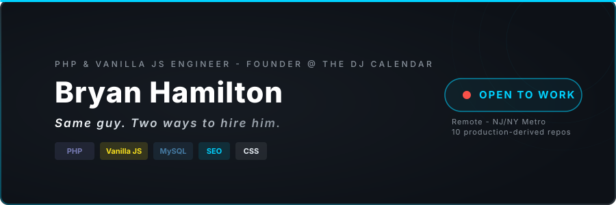
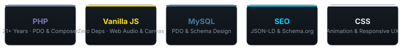

  

  
**21+ years shipping PHP and vanilla JS into production.  
Ten repos extracted verbatim from live code. No frameworks. No tutorials.**

 

I've been building for the web since the late 90s - KPMG back-office systems, NY Daily News CMS, OUTFRONT Media reaching millions of commuters daily. Today I run [The DJ Calendar](https://thedjcalendar.com), an electronic music discovery platform I founded in 2015: ~1,000 schema.org-rich pages, a custom PHP/MySQL stack, and zero-dependency tooling I build when off-the-shelf answers aren't good enough.

**Every repo here is extracted from production code.** Not a tutorial. Not a boilerplate. The actual thing, cleaned and documented.

**Currently looking for:** full-stack web engineering roles, PHP/JavaScript-focused, remote or NJ/NY metro. Also open to senior individual contributor or lead developer positions where I can ship production code and mentor junior engineers.

> **Currently building:** The DJ Calendar Newsletter system - double opt-in subscriber management, PDO-driven, for artist alerts and venue announcements.

 

 

## Featured

### [resume-hub](https://github.com/bryanhamiltondev/resume-hub)

**The landing page that powers [bryanhamilton.info](https://bryanhamilton.info).**  
8-act jQuery animation suite - particle network, typewriter, 3D card tilt, staggered entrance chain. One file, zero dependencies beyond jQuery. The portfolio anchor that ties everything together.

[`bryanhamilton.info` ->](https://bryanhamilton.info)

 

 

## The DJ Calendar Ecosystem

*Everything that powers [thedjcalendar.com](https://thedjcalendar.com) - extracted as patterns.*

<table>
<tr>
<td width="33%" align="center">

#### [dj-card-preview](https://github.com/bryanhamiltondev/dj-card-preview)

Hover-to-play audio preview card with real Web Audio EQ. The flagship demo.

`#vanilla-js` `#web-audio` `#accessibility`

</td>
<td width="33%" align="center">

#### [instant-search-index](https://github.com/bryanhamiltondev/instant-search-index)

Client-side search from a prebuilt JSON index. Scored AND matching, weighted fields, ARIA combobox. ~1,000 pages, zero server round-trips.

`#vanilla-js` `#aria` `#search`

</td>
<td width="33%" align="center">

#### [next-show-radar](https://github.com/bryanhamiltondev/next-show-radar)

Geolocation-aware tour map. Consent-first, haversine radius, race-safe Leaflet boot. Stays excellent when they say no.

`#leaflet` `#geolocation` `#privacy`

</td>
</tr>
<tr>
<td width="33%" align="center">

#### [tour-feed-pipeline](https://github.com/bryanhamiltondev/tour-feed-pipeline)

Bandsintown + Ticketmaster feeds normalized into one row shape, deduped, cached, pruned. CI-tested PHP 8.

`#php` `#api` `#etl`

</td>
<td width="33%" align="center">

#### [eq-visualizer](https://github.com/bryanhamiltondev/eq-visualizer)

8-bar sensory equalizer. Pure CSS, optional 1 KB injector, reduced-motion respect. Zero JS required to render.

`#css` `#accessibility` `#zero-dependency`

</td>
<td width="33%" align="center">

#### [sri-lazy-loader](https://github.com/bryanhamiltondev/sri-lazy-loader)

Race-safe lazy script loader with Subresource Integrity. Concurrent-caller dedupe, timeout + cleanup. What loads Leaflet safely.

`#javascript` `#security` `#lazy-loading`

</td>
</tr>
</table>

 

 

## Schema & SEO Tooling

*Because structured data isn't set-and-forget.*

<table>
<tr>
<td width="50%" align="center">

#### [jsonld-schema-audit](https://github.com/bryanhamiltondev/jsonld-schema-audit)

Zero-dependency PHP CLI that audits JSON-LD across your content. Validates required properties per schema.org type, resolves `@id` references, fails CI on regressions. **Took The DJ Calendar from hundreds of Rich Results warnings to zero.**

`#php` `#json-ld` `#seo` `#ci`

</td>
<td width="50%" align="center">

#### [wp-schema-audit](https://github.com/bryanhamiltondev/wp-schema-audit)

WordPress plugin port of the schema auditor. WP-CLI command, admin Tools page, CI self-test with pass/fail fixtures. Zero dependencies.

`#wordpress` `#plugin` `#structured-data` `#wp-cli`

</td>
</tr>
<tr>
<td width="50%" align="center">

#### [event-calendar-schema](https://github.com/bryanhamiltondev/event-calendar-schema)

MySQL schema + PDO repository for an event calendar. Idempotent event upserts, double opt-in subscribers, query-shaped indexes. Inline design decisions.

`#mysql` `#pdo` `#data-modeling`

</td>
<td width="50%" align="center">

#### [csrf-json-fetch](https://github.com/bryanhamiltondev/csrf-json-fetch)

Hardened vanilla-JS fetch wrapper. CSRF token lifecycle, header+body dual injection, single-retry on expiry, typed errors.

`#javascript` `#csrf` `#security`

</td>
</tr>
</table>

 

 

## The Toolbox

 

| Layer | What I reach for |
|-------|------------------|
| **Languages** | PHP (21+ years), JavaScript (vanilla), MySQL, JSON, Bash, HTML/CSS |
| **CMS** | WordPress since 2004, custom plugins, ACF, WP-CLI |
| **Data & SEO** | schema.org / JSON-LD, PDO, Leaflet, structured-data auditing |
| **Quality** | GitHub Actions CI, fixture-based self-tests, zero-dependency by conviction |
| **Tools** | Git, FTP/SSH, phpMyAdmin, RegEx, browser DevTools, VSCode |

 

 

## GitHub Pulse

  

 

 

**Text preferred** - <a href="sms:+12014063595">(201) 406-3595</a>  
<a href="mailto:bryan_hamilton@me.com">bryan_hamilton@me.com</a> - <a href="https://www.linkedin.com/in/bryanhamilton-nj">linkedin.com/in/bryanhamilton-nj</a>

*Built with PHP, vanilla JS, and the conviction that the best code is the code you don't have to install.*

